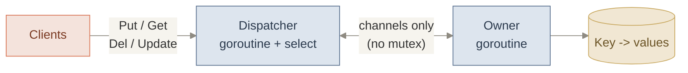
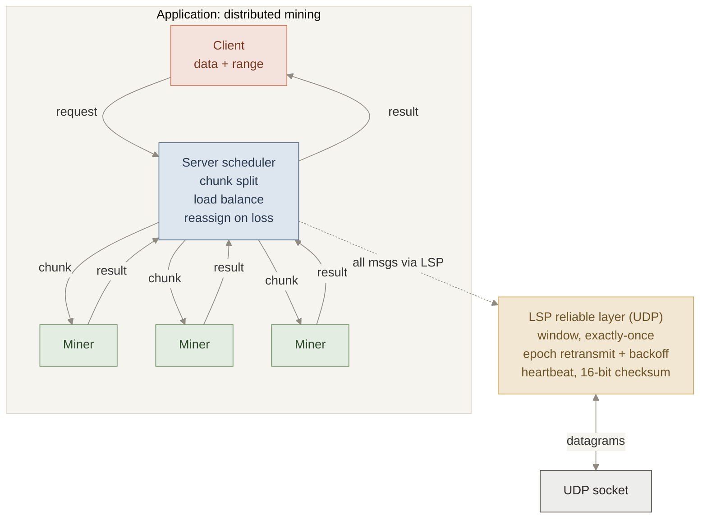
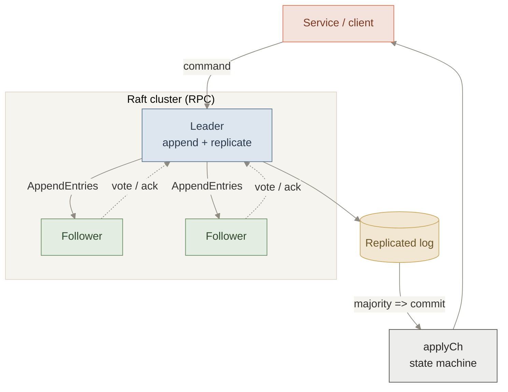
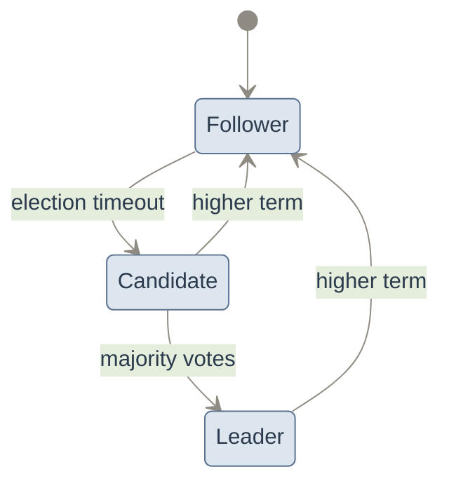
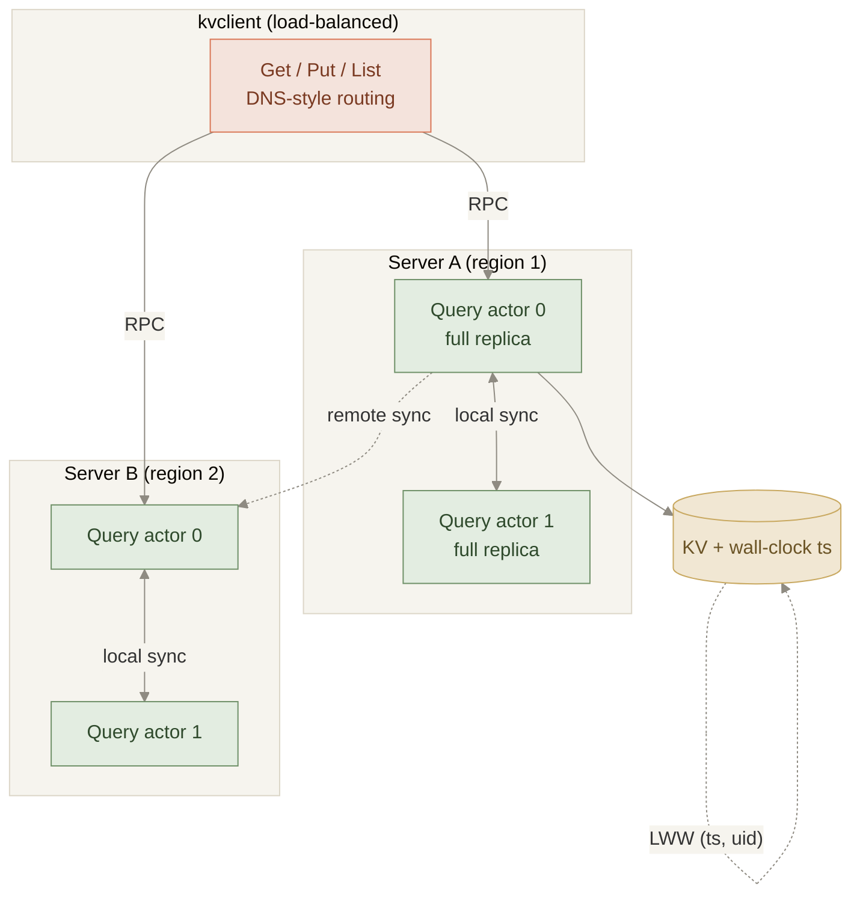
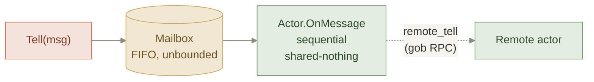

# CMU-15640-25Fall
# Distributed Systems
[Prof. Miller](https://heather.miller.am/) | Associate Professor of Computer Science at CMU

[Prof. Zheng](https://wzheng.github.io/) | Associate Professor of Computer Science at CMU

[Course Official Website](https://www.composablesystems.org/15-440/fa2025/) | [Course GitHub Site](https://github.com/15-440) | [CMU SCS Description](https://www.csd.cs.cmu.edu/course/15640/f25)

## Proj0: KV Messaging Systems & Go Testing
Projet0 focuses on giving us an introduction to Go programming and testsing, which will be further used in all later projects.
- **Key Words:** Go subroutine, mulit-thread programming, socket programming, Go-style synchronization control, key-value database server, Go testing, etc.

### Architecture

*A single owner goroutine holds the key-value map; every client request is serialized through channels and a `select` loop — **no locks or mutexes** — eliminating data races by construction.*

> **Infra highlights:** built a concurrent key-value server on Go's CSP model (goroutines + channels + `select`), achieving race-free safety and liveness without shared-memory locking; wrote property-based Go tests validating each behavior against a reference implementation.

### Part A
Part A of Proj0 is to implement the backend, a key-value database server, of a simple online messaging system, where every clients can read or modify every other clients' messages. 

My solution has the following features included:
1. Server Characteristics: `Put(K string, V []byte)`, `Get(K string) `, `Delete(K string)`, `Update(K string`, `V1 []byte, V2 []byte)`.
2. Concurrent requirements: There are **no race conditions** when accessing the database server, which guarantees the safety and liveness of the backend.
3. Synchronization control: All synchronization is handled using **goroutines, channels, and select statements, without using any locks or mutexes**.

### Part B
Part B of Proj0 is to write Go-style test cases for testsing a Squarer, which transforms a channel of integers to a channel that transmits the squares of those integers.

There is one correct implementation provided which satifies all requirments in the API doc and **we should write our own Go test cases to test each properties descriped against the correct one.**

## Proj1: Distributed Bitcoin Miner
Proj1 focuses on building a reliable distributed system on top of unreliable networks. The project is divided into two parts: implementing a reliable message delivery protocol over UDP, and then using it to build a fault-tolerant distributed Bitcoin mining system.
- **Key Words:** Multi-thread programming, Go-style synchronization control, reliable messaging, UDP-based protocol, sliding window, epoch-based retransmission, exponential backoff, distributed systems, fault tolerance, load balancing, Bitcoin, crypto cocurrency, etc.

### System Architecture

*Every message rides on **LSP**, a custom reliable protocol over UDP (sliding window, epoch retransmission with exponential backoff, heartbeats, checksums). On top of it, a scheduler splits mining jobs into nonce-range chunks, load-balances them across miners, and reassigns work when a miner fails.*

> **Infra highlights:** engineered a reliable, exactly-once messaging layer over lossy UDP and used it to build a fault-tolerant compute scheduler — chunked work distribution, dynamic load balancing, and automatic task reassignment on worker failure — the core pattern behind distributed job queues and map-reduce-style systems.

### Part A: Live Sequence Protocol (LSP)
Part A of Proj1 is to implement the **Live Sequence Protocol (LSP)**, a custom reliable client-server messaging protocol built on top of UDP. LSP provides in-order, exactly-once message delivery with connection management, failure talorance mechanisms, and retransmission logic.

My implementation includes the following core features:
1. **Reliable message delivery:** All messages are delivered exactly once and processed in order using sequence numbers (Seq) and acknowledgments (Ack).
2. **Sliding window control:** A window-based sending mechanism is implemented to limit the number of outstanding unacknowledged messages.
3. **Epoch-based retransmission:** Periodic epoch timers are used to trigger retransmissions for dropped messages and to detect failed connections.
4. **Exponential backoff:** Unacknowledged messages are resent using exponential backoff to avoid flooding the network.
5. **Heartbeat mechanism:** Explicit heartbeat messages are sent during idle periods to prevent false connection timeouts.
6. **Checksum verification:** Data integrity is ensured using a 16-bit checksum to detect corrupted packets.
7. **Concurrency model:** All synchronization is handled using **goroutines, channels, and select statements, without using any locks or mutexes**.

The protocol exposes a clean client/server API that hides all networking and reliability details from the application layer.

### Part B: Distributed Bitcoin Miner
Part B of Proj1 uses the LSP implementation from Part A to build a **distributed Bitcoin mining system** that parallelizes a compute-intensive hashing task across multiple worker nodes.

The system consists of three components:
- **Client:** Sends mining requests and receives final results.
- **Server:** Coordinates job scheduling, task distribution, and result aggregation.
- **Miner:** Executes assigned hash computations over a given nonce range and reports results back to the server.

Key aspects of my implementation include:
1. **Task decomposition:** Large mining requests are split into smaller sub-jobs and distributed across available miners.
2. **Dynamic load balancing:** Jobs are assigned to minimize response time while maintaining fairness among concurrent client requests.
3. **Fault tolerance:** If a miner fails or disconnects, its unfinished tasks are reassigned to other available miners.
4. **Failure handling:** Client disconnections cause the server to abandon corresponding requests without affecting other ongoing jobs.
5. **End-to-end reliability:** All communication between clients, server, and miners relies exclusively on the LSP protocol implemented in Part A.

This project demonstrates how a reliable messaging layer enables the construction of higher-level distributed applications that are resilient to packet loss, reordering, and node failures.

## Proj2: The Raft Consensus Algorithm
[Paper](https://raft.github.io/raft.pdf) | [Site](https://raft.github.io/) | [Illustration](https://thesecretlivesofdata.com/raft/)

Proj2 focuses on implementing the **Raft consensus algorithm**, a replicated state machine protocol that ensures fault tolerance and consistency across multiple distributed replicas.

The goal of this project is to build a fully functioning Raft module in Go that maintains a replicated log, supports leader election, log replication, and safely applies committed commands to an external service.
- **Key Words:** Consensus algorithm, replicated state machine, leader election, log replication, fault tolerance, RPC, concurrency control.

### System Architecture

*Clients submit commands to the elected **leader**, which replicates log entries to followers via `AppendEntries`; once a majority persists an entry it is committed and applied in order through `applyCh`. Server roles transition on timeouts and terms:*

> **Infra highlights:** implemented the Raft consensus algorithm end-to-end — randomized leader election, log replication with `(prevLogIndex, prevLogTerm)` consistency checks, majority-commit, and safe state-machine application — holding safety and liveness under crashes, message loss, and reordering. This is the same protocol behind etcd, Consul, and CockroachDB.

### Part A: Leader Election & Heartbeats
Part A of Proj2 is to implement **leader election** and **heartbeat mechanisms** in Raft. Each server can dynamically transition between follower, candidate, and leader states based on timeouts and RPC communication.

My implementation includes:
1. **Leader election:** Peers independently start elections after randomized timeouts and use RequestVote RPCs to elect a single leader.
2. **Term management:** Each server maintains and updates its current term to ensure monotonic progress and correct role transitions.
3. **Heartbeat protocol:** Leaders periodically send empty AppendEntries RPCs to assert leadership and prevent unnecessary elections.
4. **Failure handling:** The system correctly elects a new leader when the current leader crashes or becomes unreachable.
5. **Concurrency safety:** Shared Raft state is protected using mutexes, and all timing logic is handled via background goroutines.

This part ensures the system can reliably maintain a single leader under message loss, reordering, and server failures.

### Part B: Log Replication & Commitment
Part B of Proj2 extends the implementation to support **replicated log agreement** and **state machine application**.

Key features implemented include:
1. **Log replication:** Leaders append new commands to their logs and replicate them to followers using AppendEntries RPCs.
2. **Consistency checks:** Followers validate log entries using `(prevLogIndex, prevLogTerm)` and resolve inconsistencies by deleting conflicting entries.
3. **Commitment logic:** The leader advances the commit index once a majority of replicas have replicated a log entry from the current term.
4. **State machine application:** Each committed log entry is delivered to the service layer via the apply channel in strict log order.
5. **Correctness under failures:** The system maintains safety and liveness under crashes, network delays, and message reordering.

This project demonstrates how Raft achieves distributed consensus while remaining understandable, modular, and robust in the presence of failures.

## Proj3: CMUD
Proj3 focuses on building a **globally distributed, highly available key-value storage system** using the **Actor Model**, and applying it to support a multiplayer online game (CMUD).

The project emphasizes scalable system design, actor-based concurrency, and eventual consistency across geographically distributed replicas.
- **Key Words:** Actor model, distributed key-value store, eventual consistency, last-writer-wins, RPC, geodistributed systems, scalable backend services.

### System Architecture

*Each server runs one **query actor per CPU core**, each holding a full replica and answering reads from local state for low latency. Actors converge through background **local sync** (same server) and **remote sync** (across regions), resolving conflicts by last-writer-wins on a wall-clock timestamp with an actor-uid tiebreaker. The client load-balances across servers/actors like DNS-based routing.*

The actor runtime is shared-nothing — mailboxes + RPC, no locks or shared memory:

> **Infra highlights:** designed a geo-distributed, highly available NoSQL key-value store on an Akka-style actor model — shared-nothing concurrency, per-core replicas for horizontal scale, and eventually-consistent last-writer-wins replication across regions — directly engaging the availability/latency-vs-consistency tradeoffs at the heart of real distributed databases.

### Backend Storage System
The core of Proj3 is to implement the **backend storage system** used by the CMUD game. The system provides a simple NoSQL key-value API supporting `Get`, `Put`, and `List` operations.

Key aspects of my implementation include:
1. **Actor-based architecture:** Each server runs multiple query actors, where each actor independently maintains a full replica of the key-value store.
2. **Shared-nothing design:** Actors do not share memory and coordinate exclusively through message passing.
3. **Parallel query handling:** Multiple query actors allow the server to process client requests concurrently across CPU cores.
4. **Immediate availability:** Each query actor responds to requests using its local state without blocking on coordination with other replicas.

This design enables low-latency responses while supporting high availability.

### Actor System
Proj3 requires extending and using a custom **actor system** to coordinate both local and remote communication.

My implementation includes:
1. **Mailbox abstraction:** A FIFO mailbox implementation that supports unbounded message buffering for actor message delivery.
2. **Actor execution model:** Actors process messages sequentially and never block, ensuring deterministic local behavior.
3. **Remote messaging:** Actors communicate across machines using RPC-backed remote message delivery.
4. **Strict actor isolation:** Actors do not use shared memory, goroutines, or Go channels, enforcing the actor programming model.

The actor system provides a clean abstraction for building distributed services without explicit locking or race conditions.

### Consistency and Syncing
To keep replicas consistent while preserving availability, the storage system implements **eventual consistency** using background syncing between actors.

Key mechanisms include:
1. **Last-writer-wins (LWW):** Each `Put` operation is tagged with a wall-clock timestamp, and conflicts are resolved deterministically.
2. **Local syncing:** Query actors on the same server periodically exchange updates to ensure fast convergence.
3. **Remote syncing:** Servers sync updates with other geographically distributed servers to maintain a consistent global state.
4. **Asynchronous propagation:** All syncing happens off the critical path of query handling, preserving low latency.

This approach ensures all replicas eventually converge to the same state despite concurrent updates.

### Storage Client
In addition to the backend, Proj3 also requires implementing the **storage client** used by the CMUD application.

My implementation includes:
1. **RPC-based client API:** The client translates `Get`, `Put`, and `List` calls into RPCs to backend query actors.
2. **Thread-safe design:** Multiple concurrent client requests are supported safely.
3. **Load balancing support:** The client dynamically selects backend servers and query actors to simulate DNS-based routing and user mobility.

Together, these components enable CMUD to function as a scalable, multiplayer system backed by a globally distributed storage service.

# Disclaimer
This repository only contains descriptions of the projects I worked on during this class. As per the [Academic Integrity (AI) Policy of CMU](https://www.cmu.edu/policies/student-and-student-life/academic-integrity.html), all solutions and code are stored separately in private repositories.

If you are a hiring manager evaluating my skills, or if you are simply interested in contributing to its further development, please contact me via email.